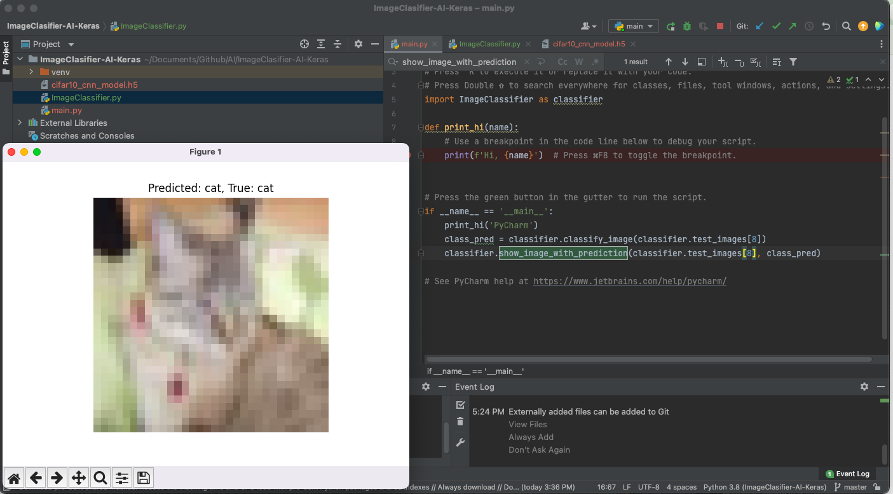

This code implements a Convolutional Neural Network (CNN) using TensorFlow and Keras to classify images from the CIFAR-10 dataset, which consists of 60,000 32x32 color images across 10 different classes. Let’s break it down step by step:



### Imports:
```python
import tensorflow as tf
from tensorflow.keras import datasets, layers, models
import matplotlib.pyplot as plt
import os
```
- `tensorflow` and `keras`: TensorFlow is used as the backend, and Keras is used for building and training the neural network models.
- `datasets`: Provides access to predefined datasets like CIFAR-10.
- `layers`: For creating various types of layers (like Conv2D, Dense) in the neural network.
- `models`: To define and handle model architectures (Sequential in this case).
- `matplotlib.pyplot`: Used for plotting and displaying images.
- `os`: Used to check if a saved model already exists on disk.

### Loading and Preprocessing the CIFAR-10 Dataset:
```python
(train_images, train_labels), (test_images, test_labels) = datasets.cifar10.load_data()
train_images, test_images = train_images / 255.0, test_images / 255.0
```
- The dataset is split into training (`train_images`, `train_labels`) and test sets (`test_images`, `test_labels`).
- The images are normalized by dividing their pixel values by 255.0, scaling them to the range [0, 1].

### Class Labels:
```python
class_names = [
    "airplane", "automobile", "bird", "cat", "deer", "dog", "frog", "horse", "ship", "truck",
]
```
- CIFAR-10 consists of 10 different classes, and this list maps the predicted integer labels to their corresponding class names.

### Model Checkpoint:
```python
model_path = "cifar10_cnn_model.h5"
if os.path.exists(model_path):
    model = tf.keras.models.load_model(model_path)
    print("Model loaded from disk.")
```
- If a pre-trained model (`cifar10_cnn_model.h5`) is already saved on disk, the code loads it. This prevents re-training every time the script runs, saving time and computational resources.

### Building the CNN Model:
```python
else:
    model = models.Sequential([
        layers.Conv2D(32, (3, 3), activation="relu", input_shape=(32, 32, 3)),
        layers.MaxPooling2D((2, 2)),
        layers.Conv2D(64, (3, 3), activation="relu"),
        layers.MaxPooling2D((2, 2)),
        layers.Conv2D(64, (3, 3), activation="relu"),
        layers.Flatten(),
        layers.Dense(64, activation="relu"),
        layers.Dense(10),
    ])
```
- If the model doesn’t exist, it creates a new CNN:
  - **First Convolution Layer**: A Conv2D layer with 32 filters, 3x3 kernel, and ReLU activation. The input shape is `(32, 32, 3)` since the images are 32x32 pixels and have 3 color channels (RGB).
  - **Max Pooling**: Reduces the spatial dimensions (downsampling) by taking the maximum value in a 2x2 window.
  - **Second Convolution Layer**: Similar to the first but with 64 filters.
  - **Max Pooling**: Another downsampling layer.
  - **Third Convolution Layer**: Another Conv2D layer with 64 filters.
  - **Flatten**: Flattens the output from the convolutional layers into a 1D array.
  - **Dense Layer**: A fully connected layer with 64 units and ReLU activation.
  - **Output Layer**: A Dense layer with 10 units, representing the 10 classes in CIFAR-10 (no activation since it will be processed by a softmax-like function during loss calculation).

### Compiling and Training the Model:
```python
model.compile(
    optimizer="adam",
    loss=tf.keras.losses.SparseCategoricalCrossentropy(from_logits=True),
    metrics=["accuracy"],
)
model.fit(
    train_images, train_labels, epochs=10, validation_data=(test_images, test_labels),
)
```
- **Optimizer**: Adam optimizer is used to adjust the model’s weights.
- **Loss Function**: Sparse categorical cross-entropy is used because the labels are integers (not one-hot encoded). Setting `from_logits=True` indicates that the final layer produces raw unnormalized scores (logits), and the loss function will apply softmax internally.
- **Metrics**: The accuracy of the model is tracked during training.
- The model is trained for 10 epochs, using the training data and validating with the test data.

### Saving the Model:
```python
model.save(model_path)
print("Model saved to disk.")
```
- After training, the model is saved to disk as `cifar10_cnn_model.h5`, so it can be loaded later without retraining.

### Image Classification Function:
```python
def classify_image(image):
    img_array = tf.expand_dims(image, 0)  # Create a batch
    predictions = model.predict(img_array)
    predicted_class = tf.argmax(predictions[0]).numpy()
    return class_names[predicted_class]
```
- **Input**: A single image.
- **Batch Creation**: `tf.expand_dims` adds a new dimension to make it compatible for model prediction (a batch of size 1).
- **Prediction**: The model makes predictions, returning a set of raw scores for each class.
- **Argmax**: The class with the highest score is selected as the predicted class.
- **Return**: The corresponding class name is returned.

### Displaying Image with Prediction:
```python
def show_image_with_prediction(image, true_label):
    predicted_label = classify_image(image)
    plt.figure()
    plt.imshow(image)
    plt.title(f"Predicted: {predicted_label}, True: {true_label}")
    plt.axis("off")
    plt.show()
```
- Displays the image using `matplotlib`, showing the predicted and true class labels.

### Invoke:
```python
class_pred = classifier.classify_image(classifier.test_images[8])
classifier.show_image_with_prediction(classifier.test_images[8], class_pred)
```
- These lines attempt to invoke an image from the test dataset (the 8th test image) and display it with the predicted class label.

### Future updates:
- This project will be updated with few more enhancements
  
